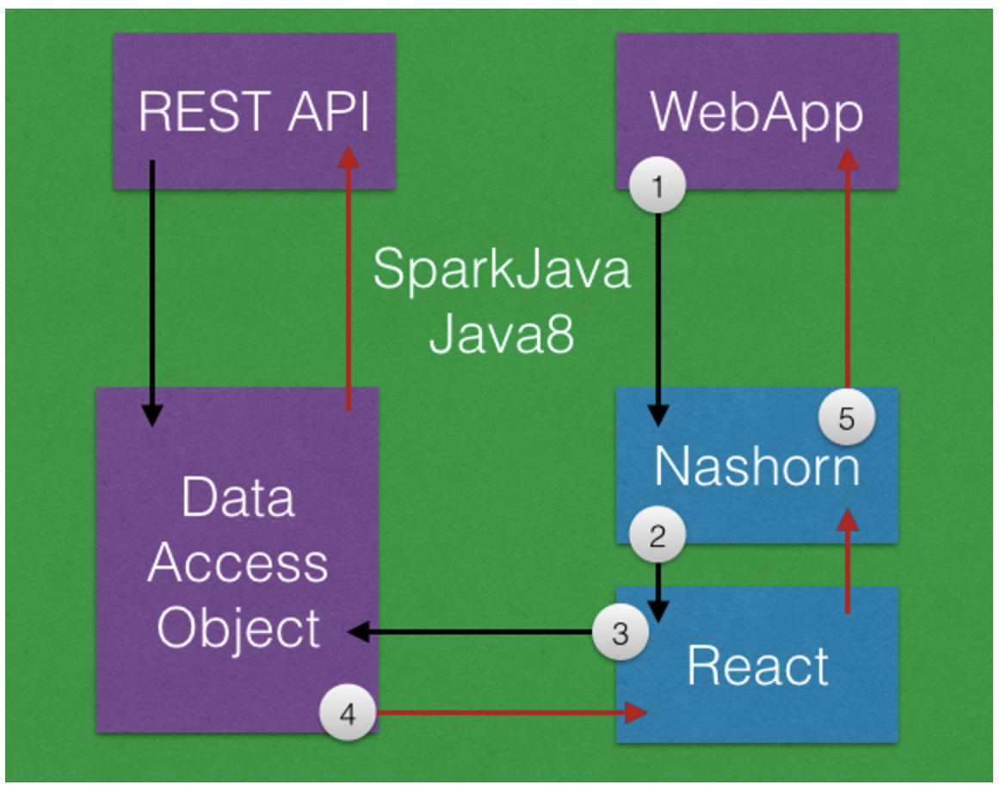

# 2015 11 31 화요일

- [일기 목록](../Diary.md)

### 오늘의 한일

 - React js 서버사이드 렌더링에 대한 탐구활동

### 서버사이드 렌더링

React.js는 실제 DOM을 의존하지 않고 컴포넌트의 VirtualDOM을 HTML로 반환하는 메서드를 갖고 있다.(매우 신기)

이 메서드를 이용해 Node.js 서버에서 React.js의 컴포넌트를 html로 만들어 반환하되, Java 클래스의 객체값들을 참조하여야 한다.

이 부분에 대한 기술 검증이 되면 메타웍스 개발의 다음 단계로 넘어갈 수 있을것이다.

어제 찾아놓은 블로그에서 이 문제의 뼈대를 다루고 있다.

[Building Isomorphic Webapps on the JVM with React.js and Spring Boot](http://winterbe.com/posts/2015/02/16/isomorphic-react-webapps-on-the-jvm/)


#### Isomorphic Webapps

Isomorphic Webapps 에 대해 필자는 다음과 같이 서술하였다.

> Traditionally webapps generate HTML on the server and send it over to the client. This has changed with the recent rise of client-side MVC frameworks such as Angular.js, Backbone.js or Ember. But generating HTML views on the client has both pros and cons. Isomorphic webapps try to close this gap by enabling you to use the same technologies for generating views both on the server and on the client.

또 리액트 JS 가  Isomorphic Webapps 으로 동작할 수 있는 근거를 다음과 같이 들었다.

> React.js is a fresh new JavaScript library for generating views programmatically. React is not a complete MVC framework - it's the V in MVC, concentrating on creating and managing views by dividing the entire UI into components. Those React components can be rendered both on the client and on the server.

이것을 토대로 몇가지 테스트를 해 보고 다음과 같은 사실을 깨달았다.

Jquary 같은 라이브러리들은 스크립트가 액티브 동작할때 라이브러리를 필요로 한다.

당연히 리액트도 react.js 라는 라이브러리가 있으니 매 동작시마다 이 라이브러리를 호출할 줄 알았다.

그런데 그것이 아니라 react.js 에 의해 한번 만들어진 컴포넌트는 그 자체로 독립적인 VirtualDOM 이며, 이것이 동작하는데는 더이상 react.js 가 필요하지 않다.

Isomorphic Webapps - react 구현을 할 경우 클라이언트에서 react 컴포넌트 생성과정을 생략할 수 있다는 뜻이다.

리액트 컴포넌트 생성을 JAVA 서버단에서 처리하고, 이것을 리엑트 메소드를 통해 스트링 변환을 하여 html 템플릿에 바인딩 시키는 과정이 필요하다.

이렇게 되면 규모가 큰 어플리케이션이나 모바일 환경에서 빠른 동작이 가능하다. (라고 여러 사람들이 말하고 있다.)

#### Nashorn JavaScrip

> The Nashorn JavaScript Engine makes isomorphic webapps on the JVM possible. Nashorn as part of the latest Java 8 release dynamically translates JavaScript into bytecode so it runs natively on the JVM.

리액트는 DOM 없이 VirtualDOM 생성이 가능하다.

다시 말하면 JVM 환경에서 에서 Nashorn JavaScript Engine 만으로도 리액트 컴포넌트를 생성할 수 있다는 이야기이다.
 
생성하는 방법은 다음과 같다.


```
NashornScriptEngine nashorn = (NashornScriptEngine)
    new ScriptEngineManager().getEngineByName("nashorn");
nashorn.eval(read("nashorn-polyfill.js"));
nashorn.eval(read("react.js"));
nashorn.eval(read("showdown.js"));
nashorn.eval(read("commentBox.js"));

```

nashorn-polyfill.js 는 Nashorn 엔진에서 console 처리 버그때문에 집어넣은것이라고 한다.

```
var global = this;

var console = {};
console.debug = print;
console.warn = print;
console.log = print;

```

이제 nashorn 엔진속에서는 리액트 및 commentBox.js 파일이 돌아가고 있다.

엔진에서 자바객체 바인딩 => 컴포넌트를 생성 => 스트링으로 반환은 다음과 같이 한다.

 - commentBox.js
 
```
.
.
.
.
var renderServer = function (comments) {
    var data = Java.from(comments);
    return React.renderToString(
        React.createElement(CommentBox, {data: data, url: "comments.json", pollInterval: 5000})
    );
};


```

 - java
 
```
Object html = engineHolder.get().invokeFunction("renderServer", comments);

```

commentBox.js 에 Java.from(comments) 부분이 있는데 nashorn 엔진에서 지원하는 것으로써 자바 변수를 스크립트에 쓸 수 있게 해준다.

java 쪽에 반환된 Object html 은 독립적인 VirtualDOM 이 되겠다.

이제 이 VirtualDOM 을 그대로 response 로 반환하면 된다.

 - controller
 
```
 @RequestMapping("/")
    public String index(Map<String, Object> model) throws Exception {
        List<Comment> comments = service.getComments();
        String commentBox = react.renderCommentBox(comments);
        String data = mapper.writeValueAsString(comments);
        model.put("content", commentBox);
        model.put("data", data);
        return "index";
    }
    
```

해당 소스코드는 [https://github.com/SeungpilPark/spring-react-example](https://github.com/SeungpilPark/spring-react-example) 에 있다.


#### Sparkjava 로 조금 더 깊이있게 구현해보자.

위의 소스코드에는 템플릿 반영과정이 없다.

템플릿 반영과 Sparkjava 를 사용한 bootstrap - admin 테마의 샘플 어플리케이션이다.

[https://github.com/SeungpilPark/sparkjava-retrofit-react](https://github.com/SeungpilPark/sparkjava-retrofit-react)

구현과정은 위와 동일하다

##### The Flow

Calling the rest-api will perform all operations in Java; the rest-api converts the incoming endpoint into calls to the data-access-object.  However, the web application calls take the following route:

1. `java8` [SparkJava](http://sparkjava.com/) calls a rendering function in the Nashorn JavaScript engine with properties from the Java process (mapped from the request query parameters)
1. `nashorn` starts rendering the component graph using `React.renderToString`
1. `nashorn` calls any Java services for data *at the time of rendering*
1. `java8` service can do anything Java can do and return results to the React component renderer
1. `nashorn` completes and returns the rendered content to `java8`
1. `java8` maps the `title` and `content` into a HTML template and returns the response 




#### Router

메타웍스 프레임워크가 할 일은 위의 플로우를 수행하야 하는것도 있지만, 저 플로우 사이에 Java class 객체와 객체에 기술된 UI컨트롤들을 JSX 코드로 Auto Generate 해야 하는 것이라고 생각한다.

이건 나만의 생각일 수 있으므로 장대표님과 논의가 필요할 것 같다.

내일은 Router 의 구현 방안에 대해 연구해봐야겠다. (프로세스 코디가 뒤로가기가 안되서 깜짝 놀랬다.)

UI 기반 Router 관련 기술은 죄다 nodejs 락 짝꿍이라서 Java 에서 가능할지 모르겠다. 


