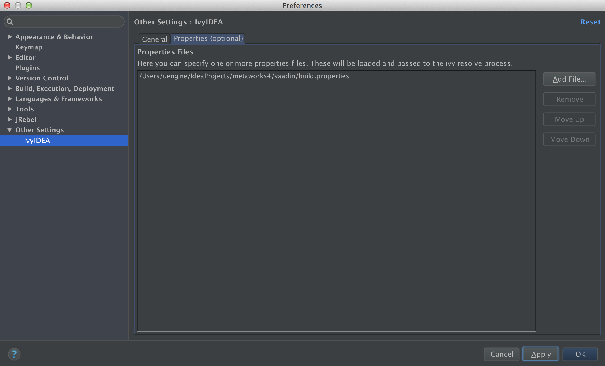

## IntelliJ IDEA 14 에서 Vaadin Framework 개발환경 구축하기

Here's instructions on how to get you up and running with Vaadin (7.3.x) development using IntelliJ IDEA 14.
If you find something to improve, please send a pull request. There might be cake available for all who contribute.

(tested and developed in OSX and IDEA Ultimate 14, so there might be differences to Windows)

### Table of Contents
* Compile [Vaadin](#compile)
* Run [Development Server](#devserver)
* Compile [Themes](#themes) and [Widgetset](#widgetset) (use the Ant build window)
* Run [CodeServer for Super DevMode](#superdevmode)
* [Debug client side inside IDEA (Firefox/Chrome)](#debug)
* Run [Unit tests](#unittests)
* Run [TB4 tests](#tb4tests)

### Getting started
#### <a name="compile"></a>0. Install IDEA 14
 - Install IvyIDEA plugin in IDEA Preferences -> Plugins

#### 1. Clone the vaadin repo
````sh

cd metaworks4

git clone https://github.com/vaadin/vaadin.git

cd vaadin

rm -rf .git

````


brew 인스톨(mac os x)

```
ruby -e "$(curl -fsSL https://raw.githubusercontent.com/Homebrew/install/master/install)"
```

ant 인스톨

```
brew update
brew install ant

```


ant 가 ivy 라이브러리를 가져올 수 있도록 다음 단계를 수행

 - [ivy jar 다운로드]http://apache.mirror.cdnetworks.com//ant/ivy/2.4.0/apache-ivy-2.4.0-bin.zip


```
cp <ivy jar file path> /usr/local/Cellar/ant/1.9.6/libexec/lib/

```

Intellij 에서도, ant 가 ivy 라이브러리를 가져올 수 있도록 다음 단계를 수행

```
cp <ivy jar file path> /Applications/IntelliJ IDEA 14.app/Contents/lib/ant/lib/

```


#### 2. Unpack GWT

아래 사항부터는 vaadin 디렉토리 안에서 수행하도록 합니다.


In order for everything to work pretty, we need to compile and unpack GWT outside IDEA.
````sh

ant -f gwt-files.xml unpack.gwt

Buildfile: /Users/uengine/IdeaProjects/metaworks4/vaadin/gwt-files.xml
[ivy:resolve] :: Apache Ivy 2.4.0 - 20141213170938 :: http://ant.apache.org/ivy/ ::
[ivy:resolve] :: loading settings :: file = /Users/uengine/IdeaProjects/metaworks4/vaadin/ivysettings.xml

unpack.gwt:
    [mkdir] Created dir: /Users/uengine/IdeaProjects/metaworks4/vaadin/build/gwt/gwt-user.jar
    [mkdir] Created dir: /Users/uengine/IdeaProjects/metaworks4/vaadin/build/gwt/gwt-dev.jar
    [mkdir] Created dir: /Users/uengine/IdeaProjects/metaworks4/vaadin/build/gwt/gwt-elemental.jar
    [unzip] Expanding: /Users/uengine/.ivy2/cache/com.vaadin.external.gwt/gwt-user/jars/gwt-user-2.7.0.vaadin3.jar into /Users/uengine/IdeaProjects/metaworks4/vaadin/build/gwt/gwt-user.jar
    [unzip] Expanding: /Users/uengine/.ivy2/cache/com.vaadin.external.gwt/gwt-dev/jars/gwt-dev-2.7.0.vaadin3.jar into /Users/uengine/IdeaProjects/metaworks4/vaadin/build/gwt/gwt-dev.jar
    [unzip] Expanding: /Users/uengine/.ivy2/cache/com.vaadin.external.gwt/gwt-elemental/jars/gwt-elemental-2.7.0.vaadin3.jar into /Users/uengine/IdeaProjects/metaworks4/vaadin/build/gwt/gwt-elemental.jar

BUILD SUCCESSFUL
Total time: 9 seconds

````

### Getting the first modules to compile
#### 3. Open metaworks4 folder in IDEA
(ignore possible warnings about missing JDK JavaSE-1.6)


#### 4. Setup project
- Open project properties
  - Select SDK of your choosing in Project -> Project SDK (tested to work with 1.7.0_51)
  - Set Project Compiler Output to vaadin/build/classes in Project -> Project compiler output
  - Delete Module vaadin from Modules

- Open IDEA Preferences
  - Open Project Preferences for IvyIDEA
  - Set Ivy Settings to use <project path>/vaadin/ivysettings.xml


  - Add <project path>/vaadin/build.properties using Properties -> Add File



#### 5. Add modules
- Select Import Module
  - Import vaadin/buildhelpers
  - Resolve dependencies by selecting IvyIDEA -> Resolve for buildhelpers module
- Repeat for module vaadin/gwt, vaadin/push, vaadin/shared
  - Note! At this point, don't include test/src folder with the modules. We will import those later.
  - For push and gwt we need to export their dependencies. Unfortunately that can't be done through the settings GUI, so we need to modify their .iml files. ````<orderEntry type="module-library">```` needs to be changed to ````<orderEntry type="module-library" exported="">````
- Import Module vaadin/server
  - Add gwt, push, shared as Module dependencies (if they aren't automatically added)
- Import Module vaadin/client
  - Exclude GWT facets (the GWT 4 xml files)
  - Add gwt, shared, server as dependencies (if they aren't automatically added)

> Unfortunately we can't use the builtin GWT features because our sources for the widgetset is divided between two modules: shared + client.

> IDEA 13 seems to have occasional difficulties when importing modules without "content" (gwt,push modules)

#### <a name="widgetset"></a>6. Getting the widgetset to compile
- Import module vaadin/client-compiler
  - Add dependencies to client, shared, gwt, server (if they aren't automatically added)
- Change the output path to build/classes for modules buildhelpers, client, shared, server, client-compiler, uitest (for Testing widgetset)
  - Module settings -> Paths
- Open the Ant Build window from View -> Tool Windows -> Ant Build
  - Add vaadin/build/ide.xml
- Run targets from ide.xml

> build/classes is the path ide.xml searches for classes when compiling the widgetset.

### Setting up debugging
#### <a name="devserver"></a>7. Running the Development Server
- Import module vaadin/server/tests
  - Rename the module to server-tests (optional)
  - Mark src folder as Sources instead of Tests in Module Settings -> Sources
  - Manually add IvyIDEA facet that points to vaadin/server/ivy.xml
  - Add dependencies to shared, push, gwt, server (if they aren't automatically added)
- Import module vaadin/uitest
  - Ignore GWT facet
  - Add dependencies to all modules we have imported
- Add Run Configuration from Run -> Edit Configurations
  - Add -> Application
  - Main class: com.vaadin.launcher.DevelopmentServerLauncher
  - VM options: -ea
  - Use classpath of module: uitest
  - Select Single Instance only
- Run the configuration

> We need to define sources inside server-tests and uitest as __sources__ instead of __tests__ because otherwise they won't be included in the module classpath when using the module as a dependency.

#### <a name="superdevmode"></a>8. Running CodeServer for Super DevMode
> This is a bit tricky because we need source directories from multiple modules to be added to the classpath and IDEA doesn't really support that. So we basically need to use a custom classpath:

- Add Run Configuration from -> Run Edit Configurations
  - Add -> Application
  - Main class: ````com.google.gwt.dev.codeserver.CodeServer````
  - VM options: ````-Xmx512M -XX:MaxPermSize=256M  -classpath "shared/src:client/src:uitest/src:build/classes:build/gwt/gwt-dev.jar:build/gwt/gwt-user.jar:build/gwt/gwt-elemental.jar:/Users/Saulis/.ivy2/cache/org.ow2.asm/asm/jars/asm-5.0.3.jar:/Applications/IntelliJ IDEA 14.app/Contents/lib/idea_rt.jar"```` <- __you need to replace paths to asm-5.0.3.jar and idea_rt.jar with ones that are correct for your environment__
  - Program arguments: ````com.vaadin.DefaultWidgetSet  -bindAddress 0.0.0.0 ````
  - Use classpath of module: ````client````
- Run the configuration

#### <a name="debug"></a>9. Debugging client side code inside IDEA
- Add Run Configuration from -> Run Edit Configurations
  - Add -> JavaScript Debug
  - Set URL to anything you want, for example http://localhost:8888/run/ValoThemeUI?restartApplication&superdevmode
  - Run the configuration with Debug
  - JetBrains IDE plugin should be automatically installed to your browser, if not, see:
    - https://www.jetbrains.com/idea/help/configuring-javascript-debugger.html
  - Add some breakpoints to client-side code and start debugging

> At the time of writing these instructions, the plugin does not seem to work on Firefox: https://youtrack.jetbrains.com/issue/IDEA-133283 - atleast not on OSX Yosemite with FF 33.1

> If the debugger doesn't seem to connect to your browser, check the browser plugin settings to ensure it's configured to use the same port that your IDEA is listening to. (see the debugger window inside IDEA to check the listened port)

#### <a name="themes"></a>10. Developing Themes
- Import module vaadin/WebContent/VAADIN/themes
- Use __themes__ target in the ide.xml Ant build to compile

### <a name="unittests"></a>Running Tests
> Server-tests module was already imported in an earlier step and they can be run as any JUnit test.

#### 11a. Set screenshot directory for running TB4 tests in JUnit
- Edit Configurations...
  - Select __Defaults__
  - Select __JUnit__
  - Add VM parameter -Dcom.vaadin.testbench.screenshot.directory=__your screenshot directory__

#### OR

#### 11b. Set screenshot directory for running TB4 tests using properties file
- Copy eclipse-run-selected-test.properties to __work__ directory
- Set com.vaadin.testbench.screenshot.directory=__your screenshot directory__ in eclipse-run-selected-test.properties

#### <a name="tb4tests"></a>12. Running TB4 tests
> If you need to run tests which use the TestingWidgetset, you need to change the build output path for uitest to point also in vaadin/build/classes. After that, you can use the testing-widgetset target in ide.xml Ant build to compile the widgetset.

- Run the Development Server configuration defined in an earlier step.
- Run the test(s) you want like a normal JUnit test.